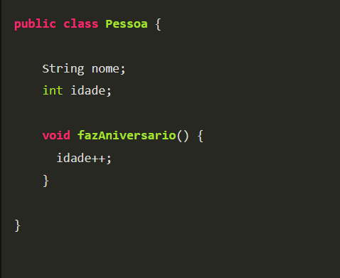
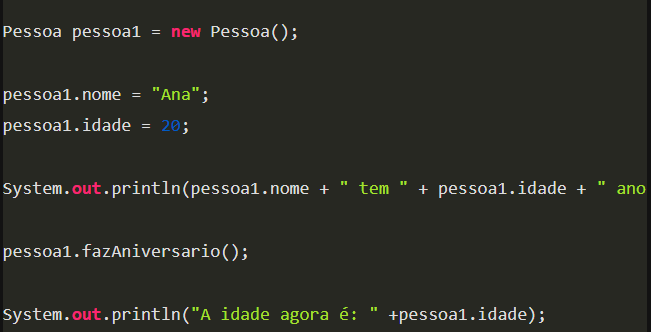
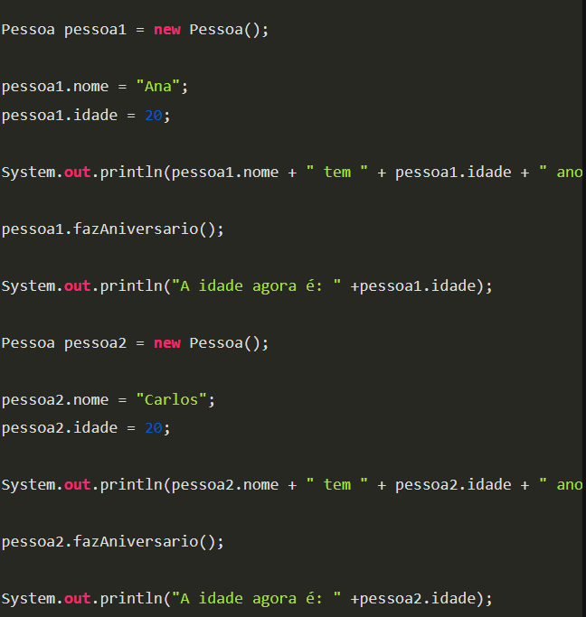

### More info: classes and objects

A class is a structure that defines a type of object. The class is like a template, which defines the characteristics (attributes) and behaviours (methods) that objects of that type will possess. For example, we could define a class called Person that has the attributes name and age, as well as the method birthday()

The syntax for defining this class in Java is as follows:

An object, on the other hand, is an instance of a class, which is how we can represent information in the application, because the class only serves to standardise objects, but not to represent an object itself. To create an object in Java, we need to use the reserved word new followed by the class name and empty brackets. For example, to create an object of type Person, we could write the following code:

In this example, we create an object from the Person class and store a reference to it in the person1 variable. As this object was created as a Person, it has the attributes name and age, as well as the birthday() method. It is from the object that we can actually represent a person, i.e. fill in the attributes and call the methods. For example:

We can create several objects of type Person, all of which will have the same attributes and methods, since they are of the same class, but each one can have different information. For example:

