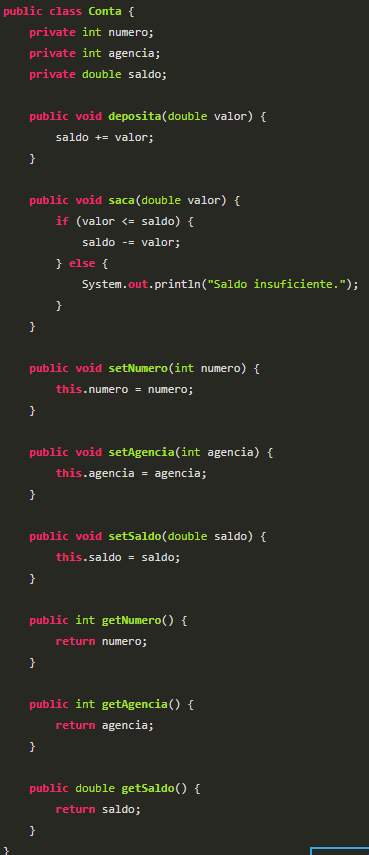
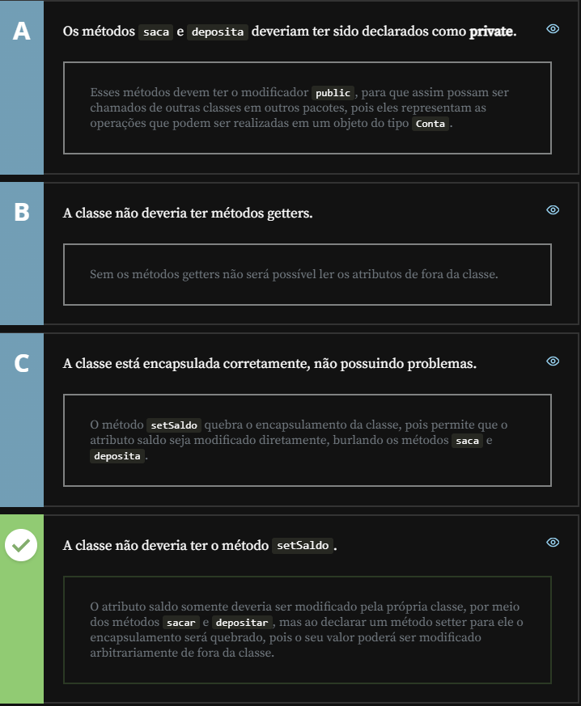

# Encapsulation 

Imagine you're analysing the code of a Java application and you come across the following class:

In relation to the concept of encapsulation, choose the alternative that indicates the problem in the previous code:

